# MattBook

Technology/library used: 
- Frontend -- Vite, ReactJS, Stripe (payment), tailwindCSS, React Hook Form
- Backend -- Cloudinary, ExpressJS, Mongoose (MongoDB), JWT
- E2E Test -- Playwright

## Overview

MattBook is a replicate of Booking.com where users can search hotel around the world. Book the hotel with the date that the wanted to stay. Users can also finish all the payment online.
Let's dive into the features of the Web App!

## Features

First of all, we have our home page:

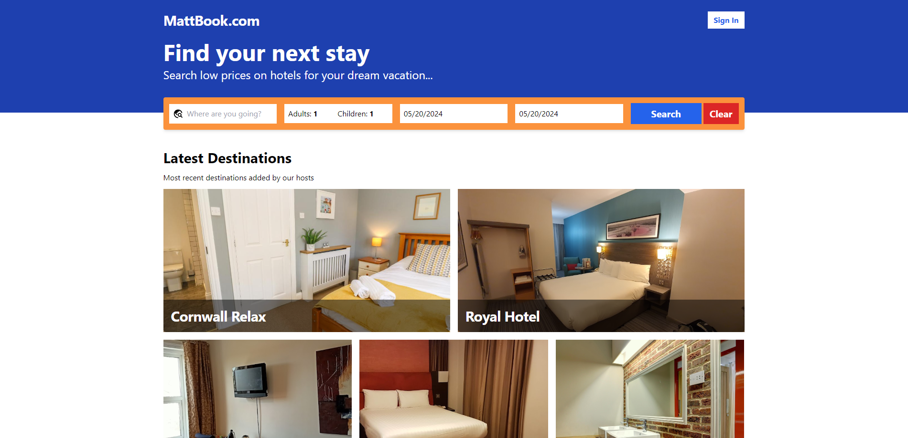

Which is responsive:

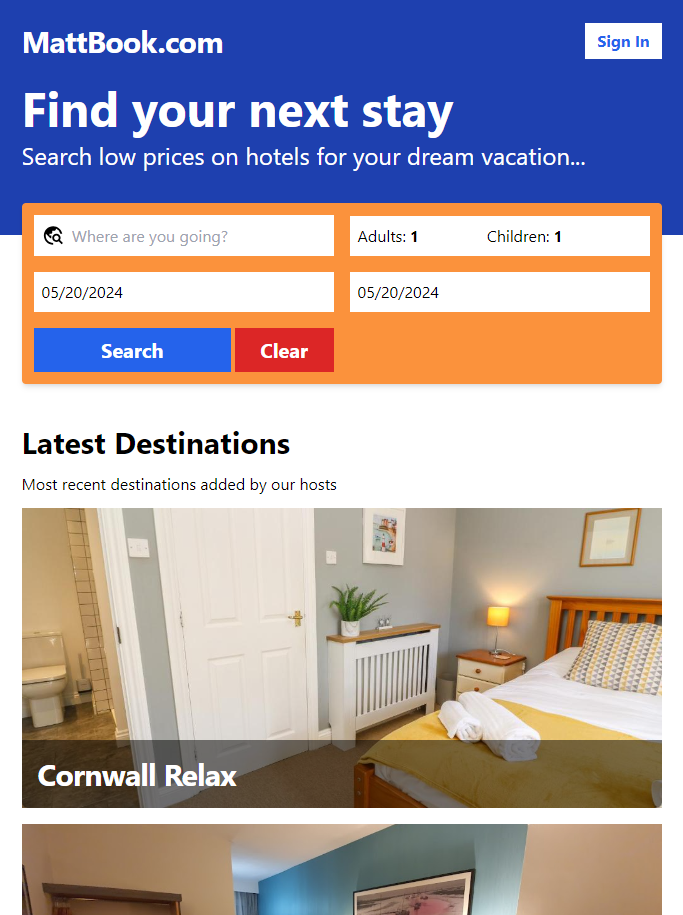

Then users can select the place, date and how many people they wanted to stay in the search bar:

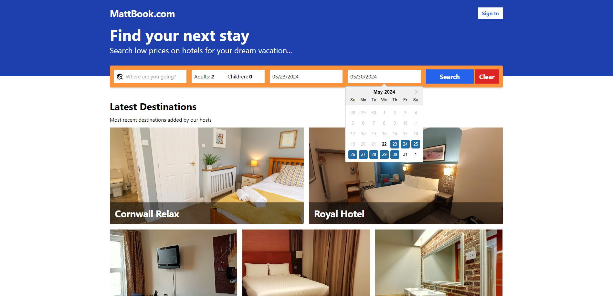

Once they hit search, the hotels found will be displayed:

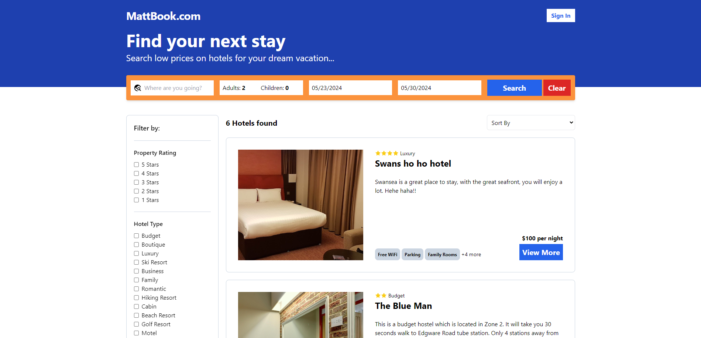

Sort and Filters are in place for users to find their best suited options:

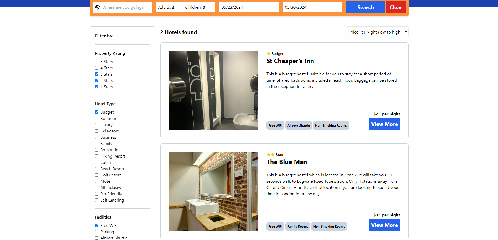

We have also got pagination in case there are too many options in one single page:

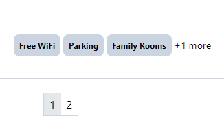

Once the user have found the hotel that they wanted to stay, they can find out more by clicking view more:

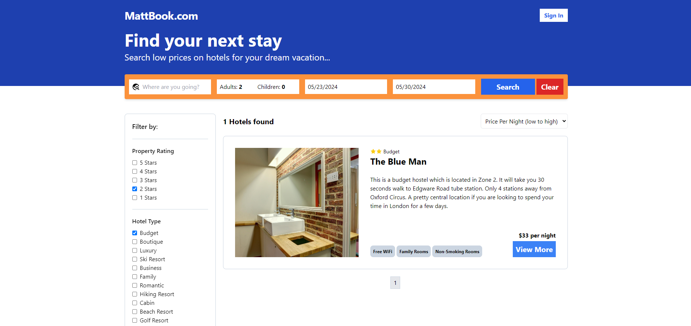

After looking throught the details of the place to stay, they can sign in to book:

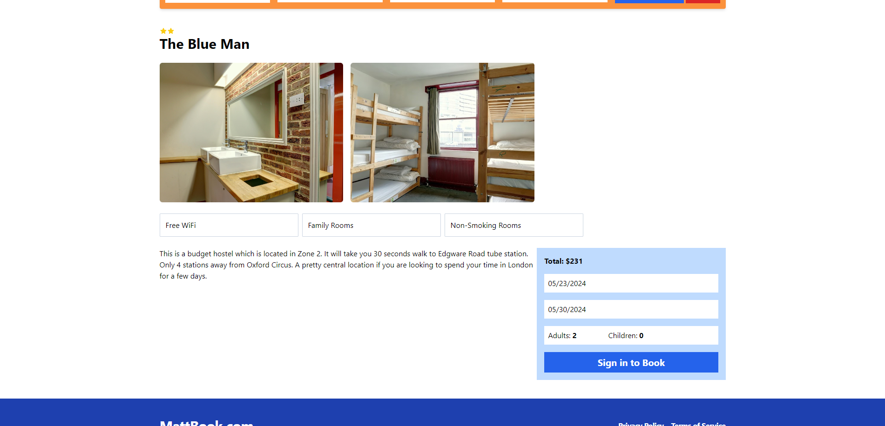

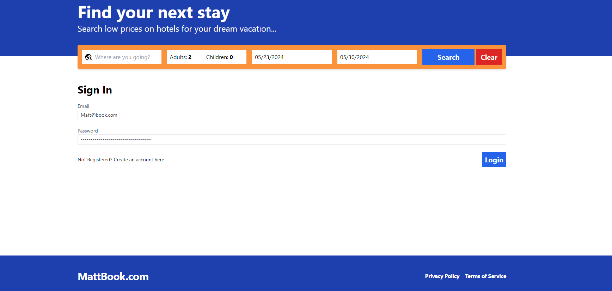

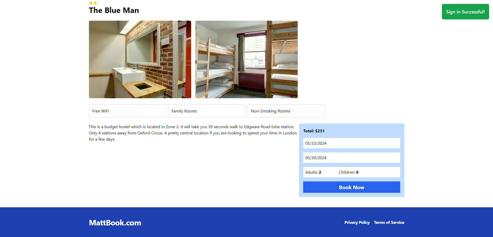

After signing in, they will be redirected to the payment page:

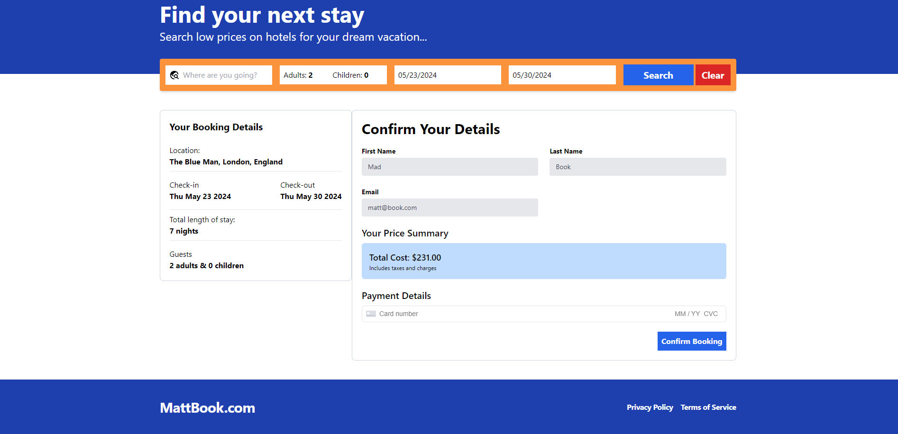

Then users can start entering their payment details, and press Confirm booking:

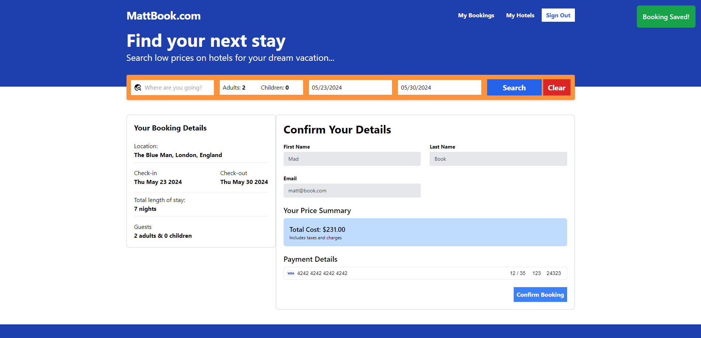

After booking successfully, the booking will be showing up on the My Bookings page:

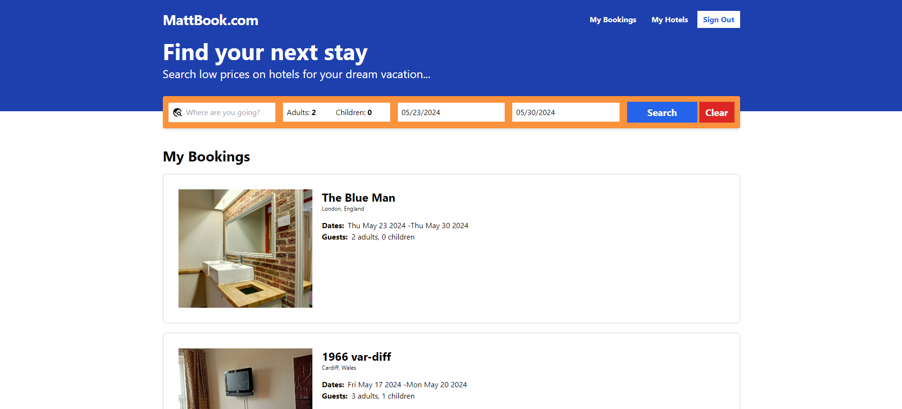

## URL

The URL of the app is not MattBook.com unfortunately.
If you want to try it out, please contact for the URL.
